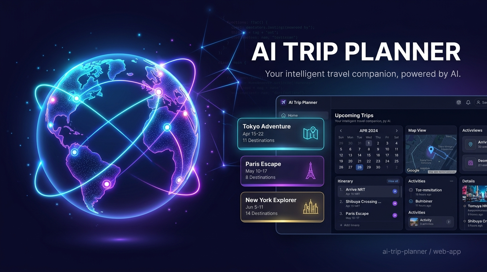

# ✈️ AI Trip Planner

<div align="center">
  

  <p><strong>Your intelligent travel companion, powered by Artificial Intelligence.</strong></p>

  [](https://nextjs.org/)
  [](https://react.dev/)
  [](https://www.typescriptlang.org/)
  [](https://tailwindcss.com/)
  [](https://ai.google.dev/)
</div>

---

## 🌟 Key Features

*   🗺️ **AI Itinerary Generator:** Generate personalized, day-by-day itineraries tailored to your specific destination, budget range, group size, and duration.
*   🏨 **Smart Lodging & Dining Recommender:** Discover curated hotel options, restaurants, and local culinary hotspots aligned with your budget and cuisine preferences.
*   📍 **Interactive Travel Mapping:** Map out daily activities sequentially to optimize transit time and view routing recommendations.
*   🎒 **Packing & Prep Checklists:** Receive automated, weather-aware packing lists and preparation advice tailored to your itinerary.
*   💼 **Budget Tracker & Optimizer:** Calculate estimated travel costs upfront, split budgets by category (stay, food, tickets), and keep expenses optimized.

---

## 🛠️ Tech Stack

*   **Framework:** [Next.js 15](https://nextjs.org/) (App Router)
*   **Language:** [TypeScript](https://www.typescriptlang.org/)
*   **Styling:** [CSS Variables / Vanilla CSS](https://developer.mozilla.org/en-US/docs/Web/CSS/Using_CSS_custom_properties) & [Tailwind CSS](https://tailwindcss.com/)
*   **AI Engine:** [Google Gemini API](https://ai.google.dev/) / Gemini Pro
*   **State & Navigation:** Built-in React State, custom Hooks, Next.js routing

---

## 📂 Project Structure

```text
ai_trip_planner/
├── public/                 # Static assets (images, icons, vectors)
│   └── banner.jpg          # Repository header banner
├── src/
│   ├── app/                # Next.js App Router (Layouts, pages, styles)
│   │   ├── globals.css     # Global stylesheets and CSS design tokens
│   │   ├── layout.tsx      # Main application frame
│   │   └── page.tsx        # Homepage (Main search and dashboard entry)
│   ├── components/         # Reusable UI components
│   │   ├── Nav.tsx         # Navbar component
│   │   └── Footer.tsx      # Footer component
│   └── utils/              # Helper functions & API handlers
```

---

## 🚀 Getting Started

To get a local copy up and running, follow these steps:

### Prerequisites

*   Make sure you have **Node.js (v18.x or higher)** and **npm** installed.
*   Obtain a **Google Gemini API key** from the [Google AI Studio](https://aistudio.google.com/).

### Installation

1.  **Clone the Repository:**
    ```bash
    git clone https://github.com/sarthakk20/Ai-Trip-Planner.git
    cd Ai-Trip-Planner
    ```

2.  **Install Dependencies:**
    ```bash
    npm install
    ```

3.  **Setup Environment Variables:**
    Create a `.env.local` file in the root directory and add:
    ```env
    NEXT_PUBLIC_GEMINI_API_KEY=your_gemini_api_key_here
    ```

4.  **Run the Development Server:**
    ```bash
    npm run dev
    ```

5.  **Open in Browser:**
    Open [http://localhost:3000](http://localhost:3000) with your browser to see the result.

---

## 🗺️ Future Roadmap

- [ ] **Interactive Interactive Maps:** Support full drag-and-drop itinerary routing on Google Maps or Mapbox.
- [ ] **Collaborative Planning:** Invite friends or family to edit and comment on plans in real-time.
- [ ] **Export to PDF/ICS:** One-click export to printable PDF format or calendar events.
- [ ] **Offline Mode:** Cache itinerary details locally using Service Workers for access on-the-go.

---

## 📄 License

Distributed under the MIT License. See `LICENSE` for more information.

<div align="center">
  <sub>Built with ❤️ by Sarthak and Powered by Google Gemini</sub>
</div>
